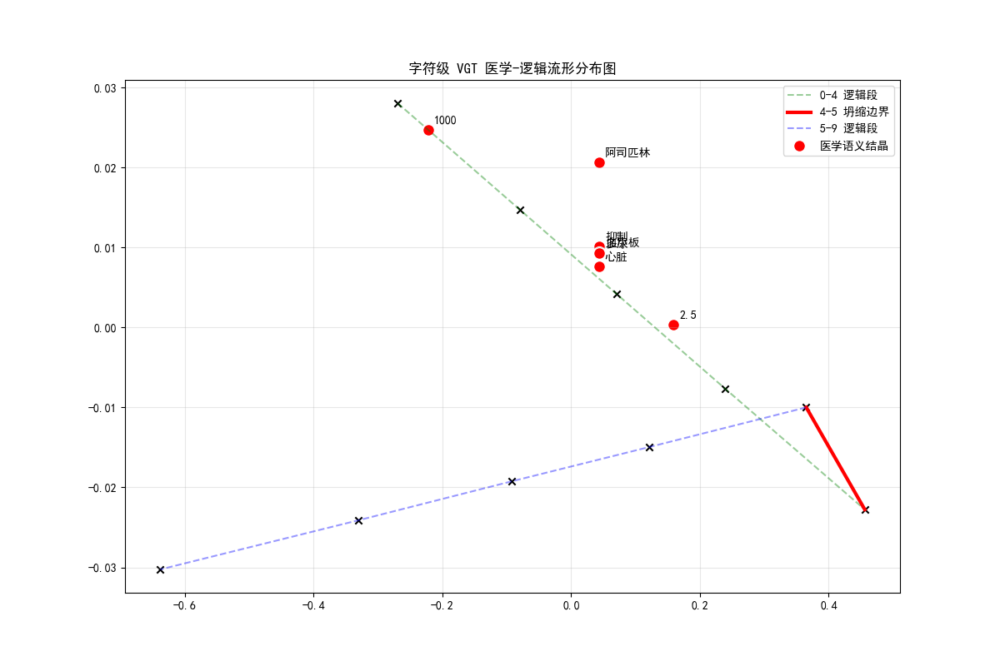
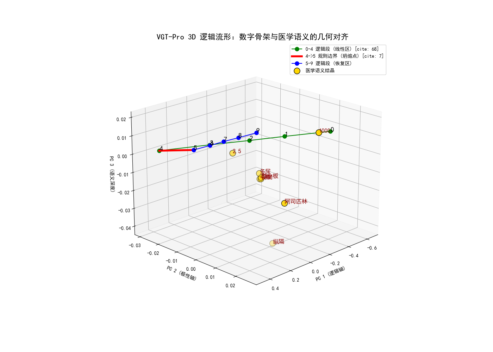

这是论文 **"Data-Efficient Logical Learning via Piecewise Constrained Geometric Manifolds"** 的官方开源实现。

## 🌟 核心突破：零样本因果推理与逻辑结晶

本项目提出了一种全新的 **VGT-Pro** 架构结合 **PCM (Piecewise Constraint Manifold) 损失函数**。通过几何流形约束，模型在仅 50 轮的小规模训练下展现了以下特性：

- **刚性逻辑骨架**：数字链 (0-9) 在隐藏层空间实现了 **1.0000 GPA (段内平行度)**。
- **几何坍缩编码**：通过 4->5 边界的 **54.5% 坍缩率** 物理性地编码了逻辑进位规则。
- **语义吸附 (Semantic Adsorption)**：医学因果链（如阿司匹林 $\rightarrow$ 抑制血小板）自动向逻辑流形聚类，实现零样本下的逻辑对齐。

## 📊 几何流形分布图 (Manifold Visualization)

这是模型在 Layer 8 形成的拓扑结构图，清晰展示了逻辑是如何从乱码中“结晶”出来的：

> **图注**：绿色/蓝色虚线代表刚性逻辑段，红色实线代表逻辑断层（进位边界），红点代表自动聚类的医学语义。

